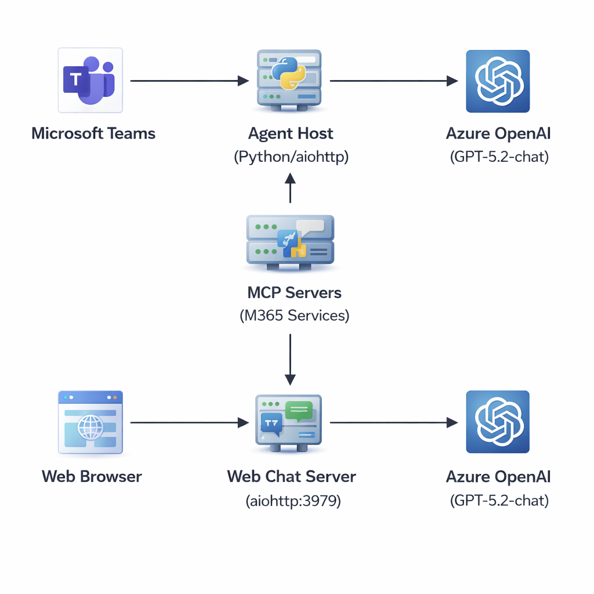
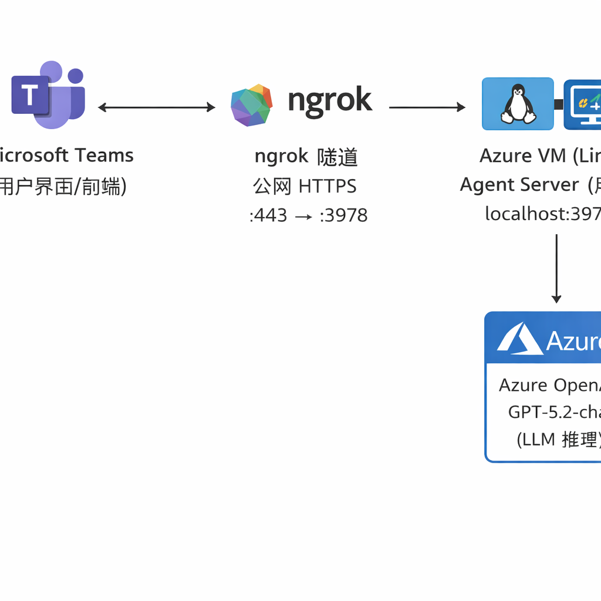

# 🤖 Agent365-Demo

## 📖 Overview

This is a demo project showcasing **Microsoft Agent 365 (A365)** — Microsoft's next-generation agent platform for building AI agents that integrate with Microsoft 365 services. The agent uses Azure OpenAI GPT models and MCP (Model Context Protocol) to connect with multiple Microsoft 365 services including Outlook Mail, Calendar, Teams, Word, Excel, and Planner.

> 🎤 Built for a TechTalk presentation demonstrating end-to-end Agent 365 deployment.

## 🏗️ Architecture Overview





### 各组件部署位置

| 组件 | 部署位置 | 说明 |
|------|----------|------|
| **前端** | Microsoft Teams (云端) | 微软托管，不需要我们部署 |
| **消息路由** | Agent 365 Platform (云端) | 微软托管，根据 Blueprint + Endpoint 路由消息 |
| **ngrok 隧道** | Azure VM (`128.85.34.109`) | 把公网 HTTPS 转发到本地 3978 端口 |
| **Agent 后端** | Azure VM (`localhost:3978`) | Python aiohttp 服务器 |
| **LLM** | Azure OpenAI (East US 2) | `gpt-5.2-chat` deployment |
| **身份认证** | Entra ID (云端) | Blueprint + Instance 身份管理 |

### 完整消息工作流

```
用户在 Teams 输入 "你好"
 │
 ▼
① Teams 客户端 → Teams 云服务 (POST 消息, 201 Created)
 │
 ▼
② Teams 云服务 → Agent 365 Platform
   根据 Instance ID 找到 Blueprint
   根据 Blueprint 找到注册的 Endpoint
 │
 ▼
③ Agent 365 Platform → ngrok URL
   POST https://<ngrok-url>/api/messages
   Body: Activity JSON (包含用户消息、用户身份、对话ID等)
   Header: Authorization Bearer JWT (Bot Framework token)
 │
 ▼
④ ngrok → localhost:3978/api/messages
 │
 ▼
⑤ host_agent_server.py 收到请求
   → JWT 验证 (或 anonymous mode)
   → 解析 Activity
   → 调用 on_message handler
 │
 ▼
⑥ agent.py 处理消息
   → 拿到用户名 (from_property.name)
   → 注入个性化 prompt
   → 调用 self.agent.run(message)
 │
 ▼
⑦ AgentFramework SDK → Azure OpenAI API
   POST https://<endpoint>/chat/completions
   Body: system prompt + user message
 │
 ▼
⑧ Azure OpenAI 返回 LLM 响应
 │
 ▼
⑨ agent.py 提取结果 → context.send_activity(response)
 │
 ▼
⑩ SDK 通过 Bot Framework API 回复 Teams
   使用 CLIENT_SECRET 认证
   消息出现在用户的 Teams 对话中
```

### MCP Servers Integrated

| MCP Server | Scope | Capability |
|---|---|---|
| `mcp_MailTools` | `McpServers.Mail.All` | Read/write Outlook emails |
| `mcp_CalendarTools` | `McpServers.Calendar.All` | Manage calendar events |
| `mcp_TeamsServer` | `McpServers.Teams.All` | Teams messaging operations |
| `mcp_WordServer` | `McpServers.Word.All` | Word document operations |
| `mcp_ExcelServer` | `McpServers.Excel.All` | Excel spreadsheet operations |
| `mcp_PlannerServer` | `McpServers.Planner.All` | Planner task management |

## 📦 Components

| Component | File | Description |
|---|---|---|
| Agent Core | `agent.py` | Main agent logic with Azure OpenAI + MCP integration (Teams path) |
| Agent Interface | `agent_interface.py` | Abstract base class for agent implementations |
| Agent Host | `host_agent_server.py` | Generic host server for Teams messaging (port 3978) |
| Web Chat | `web_chat.py` | Web chat UI with MCP + conversation memory + SQLite history (port 3979) |
| Auth Options | `local_authentication_options.py` | Local/dev authentication configuration |
| Token Cache | `token_cache.py` | In-memory token caching for observability |
| Tooling Manifest | `ToolingManifest.json` | MCP server configuration (6 servers) |
| Teams Manifest | `manifest/manifest.json` | Teams app manifest for deployment |
| A365 Config | `a365.config.json` | Agent 365 CLI configuration |

## 🌐 Deployment Locations

| Component | Location | Notes |
|---|---|---|
| Agent Host Server | Azure VM (Ubuntu 22.04) | Runs on port 3978 |
| Web Chat Server | Azure VM (Ubuntu 22.04) | Runs on port 3979 |
| Azure OpenAI | Azure East US 2 | GPT-5.2-chat deployment |
| MCP Servers | Microsoft Cloud | `agent365.svc.cloud.microsoft` |
| Teams App | M365 Admin Center | Published via manifest.zip |
| HTTPS Tunnel | ngrok | Exposes localhost:3978 to Teams |

## 🔄 Complete Message Workflow

### Teams Channel Flow
1. User sends message in Teams → Microsoft 365 platform
2. M365 routes to registered HTTPS endpoint (ngrok tunnel → localhost:3978)
3. `host_agent_server.py` receives the activity via Microsoft Agents SDK
4. JWT authentication validates the request
5. Agent host extracts user message and passes to `agent.py`
6. `agent.py` initializes MCP servers (first message only) — connects to all 6 MCP servers
7. Agent sends user message + MCP tools to Azure OpenAI
8. Azure OpenAI processes and may call MCP tools (e.g., read emails, check calendar)
9. MCP tool results are fed back to Azure OpenAI for final response
10. Response is sent back through the Agent SDK → Teams

### Web Chat Flow
1. User opens browser → `http://<VM_IP>:3979`
2. `web_chat.py` serves the HTML/JS chat UI
3. User sends message → POST `/api/chat`
4. Message saved to SQLite; last 20 messages loaded as conversation context
5. Agent receives full conversation history + MCP tools, sends to Azure OpenAI
6. Azure OpenAI processes (may call MCP tools), returns response
7. Response saved to SQLite, returned as JSON
8. UI renders the response

## 🔍 关键源代码解析

### 1. `start_with_generic_host.py` — 入口（最简单）

```python
from agent import Eva365Agent
from host_agent_server import create_and_run_host

def main():
    create_and_run_host(Eva365Agent)  # 一行启动
```

**作用**: 把 Agent 类传给 Host，启动服务器。

### 2. `host_agent_server.py` — 服务器 + 消息路由（核心）

**初始化:**
```python
self.connection_manager = MsalConnectionManager(**agents_sdk_config)  # MSAL 认证
self.adapter = CloudAdapter(connection_manager=self.connection_manager)  # HTTP 适配器
self.agent_app = AgentApplication[TurnState](...)  # Agent 应用框架
```
→ `MsalConnectionManager` 需要 `CONNECTIONS__SERVICE_CONNECTION__*` 环境变量。

**消息处理:**
```python
@self.agent_app.activity("message")
async def on_message(context: TurnContext, _: TurnState):
    user_message = context.activity.text
    response = await self.agent_instance.process_user_message(
        user_message, self.agent_app.auth, self.auth_handler_name, context
    )
    await context.send_activity(response)
```
→ `TurnContext` 是 Bot Framework 的核心概念，封装了一次对话"回合"。

**认证模式:**
```python
def create_auth_configuration(self):
    if client_id and tenant_id and client_secret:
        return AgentAuthConfiguration(
            client_id=client_id,
            client_secret=client_secret,
            scopes=["5a807f24-.../.default"],
        )
    return None  # Anonymous mode
```

**HTTP 服务器:**
```python
app.router.add_post("/api/messages", entry_point)  # Bot Framework 消息入口
app.router.add_get("/api/health", health)           # 健康检查
run_app(app, host="localhost", port=3978)
```

### 3. `agent.py` — AI Agent 逻辑（业务核心）

**创建 LLM 客户端:**
```python
self.chat_client = AzureOpenAIChatClient(
    endpoint=endpoint,
    credential=credential,
    deployment_name=deployment,  # gpt-5.2-chat
    api_version=api_version,
)
```

**创建 Agent:**
```python
self.agent = Agent(
    client=self.chat_client,
    instructions=self.AGENT_PROMPT,
    tools=[],  # 无工具（纯聊天）；加 MCP 工具在这里扩展
)
```

**处理消息:**
```python
async def process_user_message(self, message, auth, auth_handler_name, context):
    display_name = context.activity.from_property.name
    personalized_prompt = self.AGENT_PROMPT.replace("{user_name}", display_name)
    self.agent._instructions = personalized_prompt
    result = await self.agent.run(message)
    return self._extract_result(result)
```

### 4. `agent_interface.py` — 抽象接口

```python
class AgentInterface(ABC):
    async def initialize(self) -> None: ...
    async def process_user_message(self, message, auth, handler, context) -> str: ...
    async def cleanup(self) -> None: ...
```
→ 所有 Agent 必须实现这三个方法。想换 Agent 只需要写一个新类继承它。

## ✅ Prerequisites

- Python 3.11+
- Azure subscription with Azure OpenAI deployed
- Microsoft 365 developer tenant (for Teams integration)
- Agent 365 CLI (`a365`) installed
- ngrok (for HTTPS tunneling to Teams)

## 🚀 Step-by-Step Deployment Guide

### 1. Clone and Setup

```bash
git clone https://github.com/zhenyuduan98/Agent365-Demo.git
cd Agent365-Demo
python -m venv .venv
source .venv/bin/activate
uv sync  # or: pip install -e .
```

### 2. Configure Environment

```bash
cp .env.template .env
# Edit .env with your values:
# - AZURE_OPENAI_API_KEY, ENDPOINT, DEPLOYMENT, API_VERSION
# - CLIENT_ID, CLIENT_SECRET, TENANT_ID (from Agent 365 Blueprint)
# - MCP_BEARER_TOKEN (from `a365 develop get-token`)
# - MCP_ENABLE=true (to enable MCP in web_chat.py)
```

### 3. Deploy Azure OpenAI

1. Create Azure OpenAI resource in Azure Portal
2. Deploy a GPT model (e.g., gpt-4o or gpt-5.2-chat)
3. Copy the endpoint and API key to `.env`

### 4. Register an App in Microsoft Entra ID

Before setting up the Agent 365 Blueprint, you need to register an application in Microsoft Entra ID (Azure AD). This provides the `CLIENT_ID` and `CLIENT_SECRET` for authentication.

#### 4.1 Create the App Registration

1. Go to [Azure Portal](https://portal.azure.com) → **Microsoft Entra ID** → **App registrations** → **+ New registration**
2. Fill in:
   - **Name**: e.g., `Agent365-CLI-Client`
   - **Supported account types**: **Accounts in this organizational directory only** (Single tenant)
   - **Redirect URI**: Select **Public client/native (mobile & desktop)**, enter `http://localhost`
3. Click **Register**
4. On the **Overview** page, copy:
   - **Application (client) ID** → this is your `CLIENT_ID`
   - **Directory (tenant) ID** → this is your `TENANT_ID`

#### 4.2 Create a Client Secret

1. Go to **Certificates & secrets** → **Client secrets** → **+ New client secret**
2. Enter a description (e.g., `agent-dev-secret`), choose expiration
3. Click **Add**
4. **Copy the secret Value immediately** (not the Secret ID) → this is your `CLIENT_SECRET`

> ⚠️ The secret value is only displayed once. If you miss it, you'll need to create a new one.

#### 4.3 Configure API Permissions (Delegated)

Go to **API permissions** → **+ Add a permission**:

**Microsoft Graph (Delegated):**

| Permission | Purpose |
|---|---|
| `Application.ReadWrite.All` | Manage app registrations (required by A365 CLI) |
| `AgentIdentityBlueprint.ReadWrite.All` | Create and manage Agent 365 Blueprints |
| `AgentIdentityBlueprint.UpdateAuthProperties.All` | Update Blueprint authentication properties |
| `DelegatedPermissionGrant.ReadWrite.All` | Grant delegated permissions programmatically |
| `Directory.Read.All` | Read directory data (users, groups, service principals) |

**Messaging Bot API (Delegated):**

1. Click **+ Add a permission** → **APIs my organization uses**
2. Search for **Messaging Bot API** (or `BotFramework`)
3. Select **Delegated permissions** and add:

| Permission | Purpose |
|---|---|
| `Authorization.ReadWrite` | Bot authorization for Teams messaging |
| `user_impersonation` | Act on behalf of the user in Bot Framework |

**MCP Server API (Delegated):**

1. Click **+ Add a permission** → **APIs my organization uses**
2. Search for the MCP server app by its audience ID: `ea9ffc3e-8a23-4a7d-836d-234d7c7565c1` (Agent 365 Tools)
3. Select **Delegated permissions** and add:

| Permission | Purpose |
|---|---|
| `McpServers.Mail.All` | Access MCP Mail tool server |
| `McpServers.Calendar.All` | Access MCP Calendar tool server |
| `McpServers.Teams.All` | Access MCP Teams tool server |
| `McpServers.Word.All` | Access MCP Word tool server |
| `McpServers.Excel.All` | Access MCP Excel tool server |
| `McpServers.Planner.All` | Access MCP Planner tool server |
| `McpServersMetadata.Read.All` | Read MCP server metadata |

> 💡 The MCP scopes match the `scope` and `audience` fields in `ToolingManifest.json`.
> 
> 💡 If you only need the Web Chat (no Teams integration), you can skip the Messaging Bot API permissions.

#### 4.4 Grant Admin Consent

Click **Grant admin consent for [your tenant]** (requires Global Admin or Privileged Role Admin).

Verify all permissions show ✅ green checkmarks under the **Status** column.

#### 4.5 Configure Service Connection in `.env`

```env
# App Registration
CLIENT_ID=<your-application-client-id>
CLIENT_SECRET=<your-client-secret-value>
TENANT_ID=<your-directory-tenant-id>

# Service Connection (used by M365 Agents SDK for outbound auth)
CONNECTIONS__SERVICE_CONNECTION__SETTINGS__CLIENTID=<same-client-id>
CONNECTIONS__SERVICE_CONNECTION__SETTINGS__CLIENTSECRET=<same-client-secret>
CONNECTIONS__SERVICE_CONNECTION__SETTINGS__TENANTID=<same-tenant-id>
CONNECTIONS__SERVICE_CONNECTION__SETTINGS__SCOPES=https://graph.microsoft.com/.default
CONNECTIONSMAP_0_SERVICEURL=*
CONNECTIONSMAP_0_CONNECTION=SERVICE_CONNECTION
```

> The `CONNECTIONS__*` variables map to the M365 Agents SDK connection config. `CONNECTIONSMAP_0_SERVICEURL=*` means this connection handles all outbound service URLs.

### 5. Setup Agent 365 Blueprint

```bash
# Install A365 CLI
npm install -g @agent365/cli

# Login
a365 login

# Create Blueprint
a365 setup blueprint \
  --tenant-id <YOUR_TENANT_ID> \
  --subscription-id <YOUR_SUBSCRIPTION_ID> \
  --resource-group <YOUR_RESOURCE_GROUP>

# Get MCP token (for all MCP servers)
a365 develop get-token --scopes McpServers.Mail.All McpServers.Calendar.All McpServers.Teams.All McpServers.Word.All McpServers.Excel.All McpServers.Planner.All McpServersMetadata.Read.All
# Copy the token to MCP_BEARER_TOKEN in .env
```

### 6. Run the Agent

```bash
# Option A: Teams integration (port 3978)
python -m host_agent_server

# Option B: Web Chat only (port 3979)
python web_chat.py
```

### 7. Setup HTTPS Tunnel (for Teams)

```bash
# Install ngrok
ngrok http 3978

# Register the HTTPS URL with Agent 365
a365 setup blueprint --endpoint-only --endpoint https://<ngrok-url>/api/messages
```

### 8. Publish to Teams

```bash
# Generate Teams manifest
a365 publish

# Upload manifest.zip to M365 Admin Center:
# admin.microsoft.com → Settings → Integrated apps → Upload custom apps
```

### 9. Create Agent Instance (for authenticated responses)

```bash
# Create agent instance for Teams authentication
a365 setup instance \
  --blueprint-id <YOUR_BLUEPRINT_ID> \
  --tenant-id <YOUR_TENANT_ID>
```

## 🔑 MCP Token Refresh

The MCP bearer token expires after **1 hour**. To refresh:

```powershell
# On Windows (where a365 CLI is installed):

# Step 1: Clear token cache
Remove-Item "$env:LOCALAPPDATA\Microsoft.Agents.A365.DevTools.Cli" -Recurse -Force
Remove-Item "$env:LOCALAPPDATA\.IdentityService" -Recurse -Force -ErrorAction SilentlyContinue
Remove-Item "$env:LOCALAPPDATA\Microsoft\TokenBroker\Cache" -Recurse -Force -ErrorAction SilentlyContinue

# Step 2: Get new token (will open login window)
a365 develop get-token --scopes McpServers.Mail.All McpServers.Calendar.All McpServers.Teams.All McpServers.Word.All McpServers.Excel.All McpServers.Planner.All McpServersMetadata.Read.All -o raw --force-refresh

# Step 3: Update MCP_BEARER_TOKEN in .env on the VM
# Step 4: Restart web_chat.py
```

## ⚙️ Key Configuration Files

### `.env` (from `.env.template`)
Contains all secrets — Azure OpenAI keys, Client credentials, MCP tokens, and `MCP_ENABLE=true/false`.

### `ToolingManifest.json`
Defines MCP server connections (6 servers). Used when `ENVIRONMENT=Development`.
- **audience**: `ea9ffc3e-8a23-4a7d-836d-234d7c7565c1` (Agent 365 Tools MCP resource)

### `a365.config.json`
Agent 365 CLI configuration — tenant, subscription, resource group, blueprint details.

## ⚠️ Known Issues & Notes

1. **MCP Token Expiry**: The MCP bearer token expires after 1 hour. Run `a365 develop get-token` to refresh. Must clear WAM cache first to avoid getting stale tokens.
2. **ngrok URL Changes**: Free ngrok URLs change on restart. Re-register endpoint with `a365 setup blueprint --endpoint-only`.
3. **Teams 401 Error**: Agent needs an Agent Instance + Agent User for authenticated replies in Teams.
4. **SDK Naming**: The `ChatAgent` class was renamed to `Agent` in recent SDK versions. The `McpToolRegistrationService` internally uses the old name, causing a `TypeError`. The code works around this by manually extracting connected MCP tools.
5. **`AADSTS65001` consent error**: Go to API permissions → click **Grant admin consent**.
6. **`AADSTS7000215` invalid client secret**: Make sure you copied the **Value**, not the **Secret ID**. Regenerate if needed.
7. **`Directory.AccessAsUser.All` blocking blueprint creation**: This permission may be injected by WAM. Clear token cache and re-authenticate.
8. **WAM Token Cache**: Windows Account Manager may return expired tokens even with `--force-refresh`. Clear all cache directories before refreshing.

## 🛠️ Tech Stack

- **Runtime**: Python 3.11+
- **AI Model**: Azure OpenAI (GPT-5.2-chat)
- **Agent SDK**: Microsoft Agent Framework + Agent 365 SDK
- **MCP Tools**: Mail, Calendar, Teams, Word, Excel, Planner
- **Web Framework**: aiohttp
- **Database**: SQLite (chat history + conversation memory for web UI)
- **Hosting**: Azure VM (Ubuntu 22.04)
- **Tunnel**: ngrok (HTTPS for Teams)

## 📄 License

This project is for demonstration purposes. Microsoft Agent 365 SDK components are subject to Microsoft's license terms.
